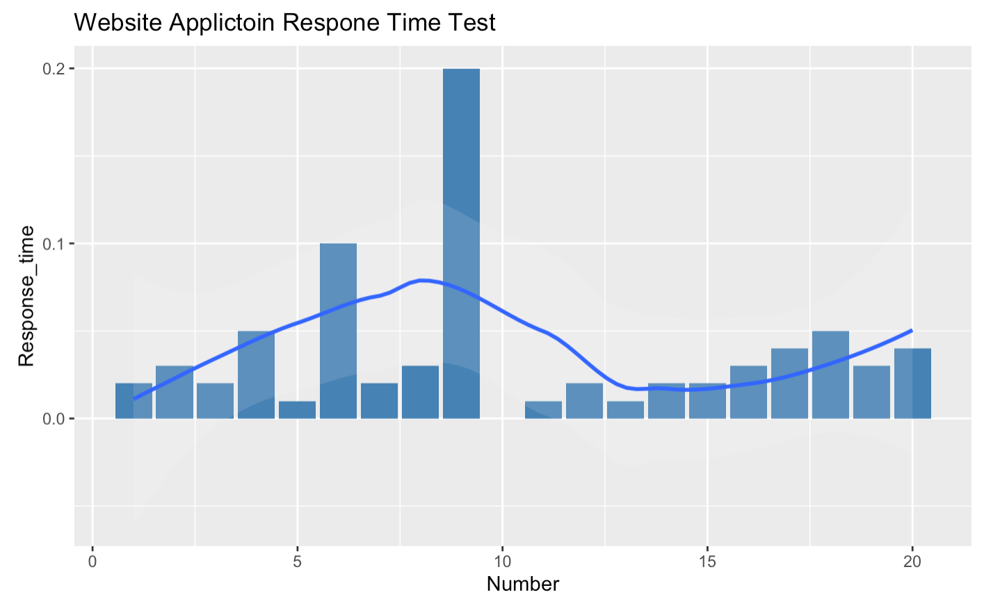
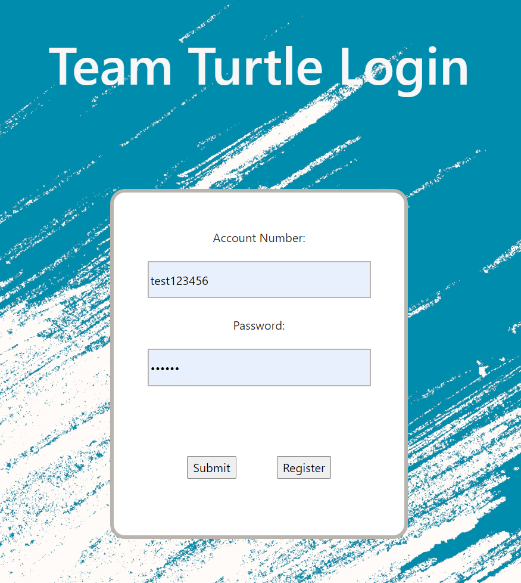

# IoT-based Medication Reminder and Dispenser

## Supervised by [**___Atif Mansoor___**](https://research-repository.uwa.edu.au/en/persons/atif-mansoor)

## Abstract
Medication adherence is necessary for the health and well-being of any individual
taking prescription medication, however, correctly managing medication can prove
to be a stressful day-to-day challenge. This report outlines decisions made in the
design of an Internet of Things (IoT)-based Medication Reminder and Dispenser
system that is able to accurately dispense pills according to a schedule set by a user,
detect whether a user has adhered to their medication plan, automatically remind
patients of upcoming medication schedules, and notify caregivers when medication
has been missed. In this report, the limitations of other medication dispensing and
reminding systems are first assessed, and key aims and requirements are outlined
for the proposed system. The system design is then comprehensively described.
A complete overview of the components involved in the system, a breakdown of
production costs, the process of design, technical challenges encountered, and a
description of how these components work together is detailed. An analysis of tests
on the system is then presented and the design of the system is assessed. Finally,
the significance of the design’s accomplishments and shortcomings are discussed,
and future developments and ethical considerations are proposed. This device
is comprised of a motor-based dispensing system; an LDR-based sensing system
for detecting the presence of pills; a WIFI-enabled gateway for communicating
information over a network; a web-based user interface for users to input their
specific medication requirements and contact details; and a server for storing user
details and sending out email reminders and notifications.

## Methodology
**[1] Data Flow**

**[2] UML Graph**

**[3] Construction**

**[4] UI**

[5] Data Testing
_Exp 1_

_Exp 2_

_Exp 3_

_Exp 4_

## Real-world
**[1] Machine**

**[2] Application**

**[3] Result**

## Author
• Nishan Devkar _23762917@student.uwa.edu.au_

• Charlie Hu *23217014@student.uwa.edu.a*u

• Ame Liu _22910358@student.uwa.edu.au_

• Alexander Turner _23423442@student.uwa.edu.au_

• Feifan Wu _22951266@student.uwa.edu.au_
